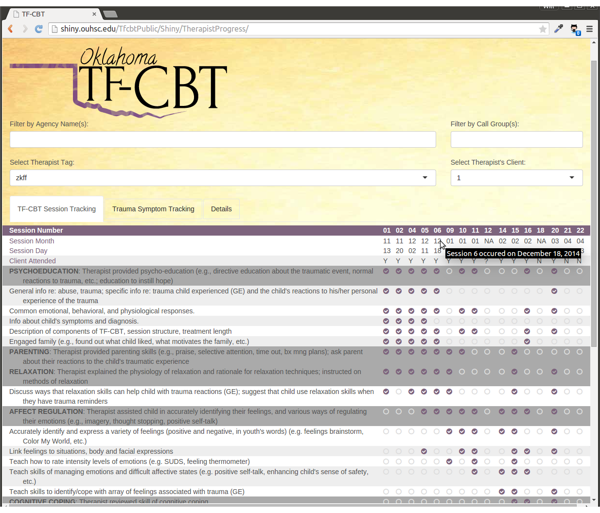
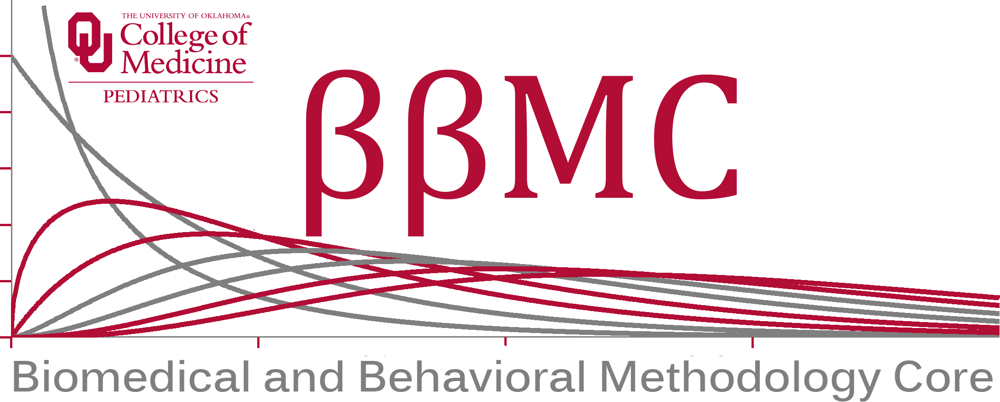

TfcbtPublic Code Repository
===========

Public Facing (and PHI-free) resources used by the [Oklahoma's TF-CBT](http://oklahomatfcbt.org/).

This [interactive report](http://shiny.ouhsc.edu/TfcbtPublic/Shiny/TherapistProgress/) contains (a) multiple clients to a therapist, (b1) multiple therapists in an agency, (b2) multiple therapists in a "call group", and (c) multiple call groups managed by an instructor/supervisor.

Therapists can filter on a few fields, which includes their "tag", which is a random 4 character ID.  All PHI stays in the [REDCap](http://project-redcap.org/) and [SQL Server](http://www.microsoft.com/en-us/server-cloud/products/sql-server/) databases. No PHI is sent to the report server.

Contact
------------
* To request information about the therapy program, please contact the TF-CBT team at http://oklahomatfcbt.org/.

* To request information about the software, please [Will Beasley](wibeasley@hotmail.com) or [Thomas Wilson](thomas-wilson@ouhsc.edu) of the [BBMC](http://www.ouhsc.edu/bbmc/) in the [OUHSC Pediatrics department](http://www.oumedicine.com/pediatrics).

